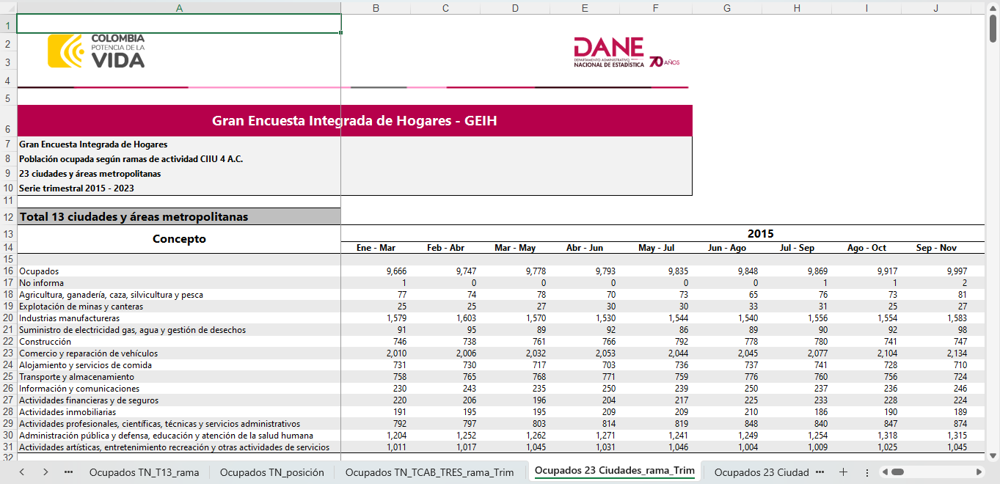

<div style='text-align: justify;'>

<div>

```{r setup, include=FALSE}
knitr::opts_chunk$set(echo = TRUE)
```

```{r libraries, include=FALSE}
library(dplyr)
library(knitr)
library(kableExtra)
library(readxl)
library(ggplot2)
library(scales)
library(RColorBrewer)
library(viridis)
```

## 1) Summary

**Describe the main goals of the project, what is the scientific question you are trying to answer, and how will you go about it in no more than 300 words.**

This master thesis will explore the influence of economic, social, demographic, political, and/or geospatial factors on job creation in major Colombian cities, depending on their relevance and effect. The central question it seeks to answer is whether focusing local public policy on these key factors can positively impact job creation. To approach this question, the study will conduct a comprehensive literature review on the current job market situation in Colombia, utilizing the "Gran Encuesta Integrada de Hogares" by DANE (National Statistical System) for historical job evolution data across major cities and sectors. The research will then examine various datasets representing these factors over the same historical period to identify their effects on job statistics. These datasets could include population dynamics, education levels, sector-specific employment trends, purchasing power, basic service coverage, trade volumes, crime rates, taxation, business ecosystem evolution, syndicate activities, corruption perceptions, geographical location, and contract types, just to name a few. By integrating these data sets into a model, the thesis aims to discern patterns and relationships that could guide public policy for enhanced job creation, with the potential to extend insights to Latin America and beyond or determine if this type of approach is not viable for said intention. This effort not only seeks to contribute to academic knowledge but also to offer practical tools for policymakers aiming to foster employment growth.

## 2) Motivation and background

**Why is this research question interesting to you, how does your background align with the topic, and what skills or knowledge do you want to acquire by doing the work that is valuable for your future career?**

My interest in the dynamics of job creation within Colombian cities comes from a deep-seated belief that public policy should be informed by data-driven insights to effectively tackle the challenges of poverty and job insecurity torturing the nation. As an Industrial Engineer from Barranquilla, a city pivotal in Colombia's historical development, cultural exchange, and innovation hub, I've witnessed firsthand the inequalities and structural issues facing our communities. All around the country there is this feeling that the Colombian society is divided in two realities, one filled with an ambitious and successful economy that is always evolving and powers through no matter the present difficulties, and in the other hand another one plagued by a perceived eternal and ruthless poverty, in which not even several generations of small progresses could improve people’s lives significantly. These observations have fueled my desire to contribute towards finding sustainable solutions for improving job security and diversity across all regions of Colombia and understand what are the main factors that affect this gap between our society’s realities.

My academic journey, improved significantly by the Master of Data Science for Public Policy program at the Hertie School, has equipped me with a unique blend of analytical tools and a comprehensive understanding of public policy formulation. This background not only aligns with but also deeply influences my research interests, driving me to bridge the gap in academic discourse regarding the feasibility of data-centric approaches to public policy and job creation, especially in the Colombian and Latin American context.

Through this work, I aim to further develop my expertise in data science, focusing on causality, regression, prediction, time series, and statistical analysis. Enhancing my coding skills and refining my ability to conduct research and solve complex problems are among my top priorities for this thesis. Additionally, I seek to gain a deeper understanding of Colombia's labor market, its history and underlying issues, and the potential for a model-driven approach to address unemployment in its cities. The aspiration is to not only contribute to academic knowledge but also to lay the groundwork for scalable, data-driven solutions that could benefit Colombia and potentially other nations facing similar challenges.

## 3) Introduction

**Discuss what is the context for the research question and what previous work has been conducted in this area. Please discuss 1-3 key academic papers that are most relevant to your project. You should summarise the papers, the goal and achievement of the papers, data and methods used in the papers, and how they relate to your proposed topic. Also include references to other relevant papers in the introduction as needed.**

Since its independence in 1819, Colombia has gone through various ideologies throughout its relatively modern history. Periods of centralism, federalism, conservatism, liberalism, internal conflict, and peace processes have marked a complicated journey for the inhabitants within its borders, and nowhere is this more evident than in the distribution and diversity of the Colombian job market. The country’s unique socio-economic landscape has been shaped over the years by various economic, social, demographic, political, and geospatial factors. With most of its population historically based in the center of the country, high in the Andes mountains in the city of Bogotá, the other population centers scattered throughout the country’s diverse landscape have had to find their economic, cultural, and industrial identity and provide stability for their local populations. Major commercial and administrative centers like Bogotá and Medellín, port cities filled with trade and tourism like Barranquilla, Cartagena, and Santa Marta, coffee and rich agricultural products producing cities like Pereira, Manizales, and Ibagué, or industrial and manufacturing hubs like Cali and Bucaramanga, have had to develop their own unique and complex strategies to provide their inhabitants with economic stability and some sort of job security.

In order to understand this master thesis research question (*Is it possible to have a positive impact on job creation in Colombian cities by focusing local public policy efforts on key economic, social, demographic, political, or geospatial factors?*), a thorough research of academic and governmental sources regarding the possibility of linking these factors to variations in local job creation must be performed. The role of local-level public policy involving these factors is crucial in the Colombian context since it will offer a lens through which the disparities in the nation’s job market could be understood, and it will serve as a guide for present and future local public officials on what their focus should be when drafting these policies.

There have been some attempts in trying to understand the effects local factors have in local employment growth, like the academic paper "Do Local Factors Explain Local Employment Growth? Evidence from Canada 1971–2001" by Richard Shearmur and Mario Polèse, which analyzes the impact of local and structural factors on employment growth in Canada. The goal of this study is to determine the relative importance of local (endogenous) and structural (exogenous) factors in regional employment growth. The paper concludes that both local and structural factors significantly influence employment growth, with structural factors often playing a dominant role [@Shearmur_Polese_2007]. Shearmur and Polèse use a panel data approach covering the period between 1971 and 2001. Panel data analysis is a statistical method that involves data collected over a period of time and across different individuals, entities, or segments. This type of data allows researchers to observe changes over time and make comparisons across different subjects. It is particularly useful for understanding complex social, economic, or environmental phenomena where both temporal dynamics and cross-sectional variation are important. Applying panel data analysis could provide insights into how job creation in Colombian cities evolves over time, while accounting for variations among different cities.

Another key academic paper that proved to be useful for this project is Christian Manuel Posso ‘s "The Quality of Employment and Labor Segmentation: An Analysis for the Colombian Labor Market 2001 to 2006", which focuses on the quality of employment and labor market segmentation in Colombia. The primary goal of this paper was to analyze the country’s employment quality using labor market segmentation theory and empirical measures. It successfully demonstrates the significant role of university education across income distribution and validates key propositions of labor market segmentation theory in Colombia [@Christian_Manuel_2010]. Posso uses data from the National Administrative Department of Statistics' (DANE) continuous household surveys from 2001 to 2006, part of the same one we will be analyzing later. The study employs Switching Regression and Quantile Regression models to test the hypothesis of labor market segmentation, providing an in-depth understanding of the Colombian labor market's dynamics. Switching regression models focus on analyzing data across different regimes, identifying how the relationship between variables changes under varying conditions or states, and in the other hand, Quantile Regression models are a statistical technique that models the relationship between variables for different quantiles of data, providing insights into how this relationship varies across the entire distribution of a dependent variable. These models could be instrumental in analyzing the labor market in Colombian cities, allowing us to understand how different factors impact various segments of the job market, and how these relationships might change under different economic or social conditions.

Finally, "Competitividad y Desarrollo Económico Local: Nuevas Oportunidades Operativas" by Juan J. Llisterri from the Inter-American Development Bank outlines a strategic framework for bolstering local economic competitiveness, focusing on the synthesis of public-private partnerships, innovation, and infrastructural development. By analyzing case studies in the Latin American context and employing qualitative methodologies, this paper presents a comprehensive overview of how localized economic strategies can pivot cities towards greater productivity and employment opportunities. It emphasizes the need for local governments and private sectors to address productivity improvement and local income generation for sustainable development in subnational territories. The paper aims to introduce components and operations that specifically address economic development in subnational programs. It discusses the importance of redefining competitive advantages of each territory in the new globalized economy, addressing territorial imbalances, and enhancing factor markets locally [@Llisterri]. Llisterri examines the different types of subnational territories and the roles of various actors in local productive systems, identifying key operational areas for economic growth. This approach could be applied for this project to qualitatively analyze how different Colombian cities have developed unique economic identities and strategies, providing insights into the factors that have led to successful job creation and economic development in these cities.

By engaging deeply with these pivotal studies, this thesis aims to bridge the gap between theoretical insights and practical policy implications, focusing on the identification of key levers for enhancing job creation and labor market quality in Colombian cities. The methods and goals from these studies will not only shape the way this research will be conducted, but they also highlight the need for a comprehensive approach that considers various aspects to effectively tackle the complexities of the history and future of urban labor markets in the country.

## 4) Research question

**What research question will you try to answer with the thesis and what is the main approach to address the question? If you are testing hypotheses, specify them here as well.**

The research question I would like to answer right now is: *Is it possible to have a positive impact on job creation in Colombian cities by focusing local public policy efforts on key economic, social, demographic, political, or geospatial factors?* For the time being I haven't decided what type of hypothesis I would like to test out since I need to define what methodology I would like to use. Some hypothesis I could think of that could be interesting to try and dive deeper into could be:

1.  Economic and infrastructure-focused factors have a more significant impact on job creation in Colombian cities than social or political ones.
2.  Cities with higher levels of education and skill development programs and policies experience greater job creation than its counter parts.
3.  Geospatial factors, such as proximity to trade routes or urban centers, significantly influence the effectiveness of local public policies on job creation.

## 5) Data and methods

**What data and methods are you planning to use? Please be as specific as possible in what you want to approach to achieve to facilitate further discussion whether it is appropriate for answering the research question. Also mention alternative methods, especially if you are unsure about which method is best. This is the core part of the PAP!**

I would like to be able to determine from key economic, social, demographic, political, or geospatial factors of Colombian cities, what is the effect these have on local job creations. For this I’m planning on basing my project on DANE's Gran Encuesta Integrada de Hogares (as my prediction variable). For my possible x variables, I’m thinking of looking into the following historical data sets from the major Colombian cities:

-   Population evolution in cities
-   Evolution of % of educated citizens / level of education in cities / % of citizens on different education levels (university, high school, primary, none)
-   Evolution in \# of jobs (per sector) in cities
-   Evolution of purchasing power / multidimensional poverty in cities
-   Evolution of coverage of basic services (gas / water / electricity) in cities
-   Evolution of imports and exports of cities
-   Evolution of crime rates in cities
-   Evolution of taxes (per sector) in cities
-   Evolution of micro, medium, and large companies (per sector) in cities
-   Evolution in \# of companies' clusters (per sector) in cities
-   Evolution in \# of syndicates (per sector) in cities
-   Evolution of local authorities’ corruption in cities
-   Longitude and Latitude location of city (geographic location)
-   Evolution of % of workers by contract type

When it comes to the planned methodology for this project, I'm still in the process of defining the appropriate it one, but from the conducted literature review so far I have found several options that could be implemented:

1.  Utilizing a mixed-methods approach, combining quantitative data analysis with qualitative case studies.
2.  Analyzing panel data to observe the impact of factors' interventions over time across multiple cities on job creation metrics.
3.  Employing regression models to identify correlations between the evolution of economic, social, demographic, political, or geospatial factors and job creation metrics.

Other alternative methods that I might have to consider for this project could be:

1.  Conducting a time series analysis to identify the effects on job metrics' evolution with regards to economic, social, demographic, political, or geospatial factors over time.
2.  Dive into Machine learning techniques, such as decision trees or random forests, that can be used to identify complex nonlinear relationships between a multitude of factors and job creation metrics.

## Data Report

As stated on section 5 of the PAP, I have several datasets I wish to look into and retrieve in order to conduct my analysis with. Most of them are available in Colombia's National Statistical Agency (DANE), but require some intense data cleaning and manipulation in order to set them in a functional format. Some of the data sets I wish to retrieve for my analysis, basing my choice from the literature review conducted so far, would be the following:

```{r echo=FALSE, results='asis', warning=FALSE}
Possible_datasets <- read_excel("C:/Users/alvar/OneDrive/Documents/GitHub/Hertie_School_MDS_Master_Thesis/Datasets/List_of_Possible_Data_Sets.xlsx")
knitr::kable(Possible_datasets, caption = "Possible Datasets")
```

Let's discuss the 1st and 3rd tables I've acquired so far. I already organized the official Colombian Population evolution in cities, but I'm missing to clean it, add the descriptions to the columns, and just have the time periods necessary for my analysis, as well as the cities that are interesting to my research.

```{r echo=FALSE, results='asis', warning=FALSE}

population_data <- read_excel("C:/Users/alvar/OneDrive/Documents/GitHub/Hertie_School_MDS_Master_Thesis/Datasets/DCD-area-proypoblacion-Mun-1985-2035-(Population Evolution of Cities).xlsx")

summary_df <- summary(population_data)

# Using kable to create a nicely formatted table
kable(summary_df, format = "html") %>%
  kable_styling(bootstrap_options = c("striped", "hover"))
```

This table doesn't contain any missing values:

```{r echo=FALSE, warning=FALSE}
# Count Missing Values
na_count <- population_data %>%
            summarise_all(~sum(is.na(.)))
na_count
```
To see what this data looks like, let's observe how has the population of Bogotá, Medellín, and Cartagena changed over the years of 1985 and 2023:


```{r echo=FALSE, results='asis', warning=FALSE}
# Ensure that Población is numeric
population_data$Población <- as.numeric(population_data$Población)
# Ensure that AÑO is numeric
population_data$AÑO <- as.numeric(population_data$AÑO)

# Filter the data for Medellín, Bogotá, and Cartagena de Indias and Área Geográfica Total
some_cities_data <- population_data %>%
  filter(MPIO %in% c("Medellín", "Bogotá, D.C.", "Cartagena de Indias"), AREAGEOGRAFICA == "Total")

ggplot(some_cities_data, aes(x = AÑO, y = Población, color = MPIO)) +
  geom_line() + # Use geom_line for time series/line chart
  scale_y_continuous(labels = label_comma()) + # Format the y-axis labels
  scale_x_continuous(limits = c(1985, 2023)) + # Set the x-axis limits
  labs(title = "Population Growth Over Time",
       x = "Year",
       y = "Population",
       color = "City") +
  theme_minimal() +
  theme(plot.title = element_text(hjust = 0.5)) # Center the title
```


For the next dataset I've been working on, I have already created a script to clean and organize the data from the GEIH. Translated form the DANE website, the GEIH (Gran Encuesta Integrada de Hogares) *is a survey that collects information about individuals' employment conditions, such as their employment status, type of work, earnings, whether they have health insurance, and if they are job-seeking. In addition to these employment-related questions, the survey also gathers general demographic details like gender, age, marital status, and educational level, as well as information about their sources of income. The GEIH provides the country with data at the national level, for main cities and the remaining areas, regionally, by department, and for each of the departmental capitals.*

It is the most up to date and closest to reality dataset of Colombian's employment conditions. With this dataset we will be able to understand how has the labor market evolved on a national and local level through out the years.The following is how the original excel file looks like: 

```{r out.width = "100%", echo=FALSE}
 
```
The following is the current state of my cleaned GEIH dataset. I've managed to transform the wide-format information into a more useful and condensed long format table, in which we've identified the 23 biggest cities we will be choosing from to focus my research on, standardized the time periods, and clean any missing values. Here you can see the summary of the 4 columns we are working with as well as the first 25 rows of the new long dataset. 

```{r echo=FALSE, warning=FALSE}
geih_data <- read_excel("C:/Users/alvar/OneDrive/Documents/GitHub/Hertie_School_MDS_Master_Thesis/Datasets/Cleaned Data Sets/GEIH_cleaned_2015-01-2023-07.xlsx")

# Output a summary of the dataframe
summary_geih <- summary(geih_data)

# Using kable to create a nicely formatted table
kable(summary_geih, format = "html") %>%
  kable_styling(bootstrap_options = c("striped", "hover"))

head(geih_data,25)
```
This table as well doesn't contain any missing values:

```{r echo=FALSE, warning=FALSE}
# Count Missing Values
na_count_geih <- geih_data %>%
            summarise_all(~sum(is.na(.)))
na_count_geih
```

This dataset contains 103 months of information from 2015 until 2023 belonging to the distribution of jobs in 14 different economic sectors (as well as a total of a joint "Occupied" statistic and "Non Informant"), throughout 23 of the biggest Colombian cities (and a statistic for the joint 13 biggest cities) as well as the metropolitan area of some. The following are the unique cities and economic sectors in this data set. 

```{r echo=FALSE, warning=FALSE}
# Identify and display the unique values for "city", "Concepto", and "date"
unique_cities <- unique(geih_data$city)
unique_conceptos <- unique(geih_data$Concepto)
unique_dates <- unique(geih_data$date)

# Here, we choose 4 columns for illustration
city_matrix <- matrix(unique_cities, ncol = 4, byrow = TRUE)
conceptos_matrix <- matrix(unique_conceptos, ncol = 4, byrow = TRUE)

# Use kable to create a nicely formatted table with a title
kable(city_matrix, format = "html", caption = "List of Unique Cities") %>%
  kable_styling(bootstrap_options = c("striped", "hover")) %>%
  column_spec(1:4, width = "25%") # Adjust the width of all columns to be equal

kable(conceptos_matrix, format = "html", caption = "List of Unique Economic Sectors") %>%
  kable_styling(bootstrap_options = c("striped", "hover"))%>%
  column_spec(1:4, width = "25%") # Adjust the width of all columns to be equal

```
Let's take the city of Barranquilla for example. In the following graph we can observe how the the different economic sectors have had fluctuations in the # of workers over the time period evaluated. 

```{r fig.width=10, fig.height=6, echo=FALSE, results='asis', warning=FALSE}
# Filter the data to only include the city of Barranquilla and Concepto is not NA
barranquilla_data <- geih_data %>%
  filter(city == "BARRANQUILLA A.M.", !is.na(Concepto))

# Create a ggplot
ggplot_barranquilla <- ggplot(barranquilla_data, aes(x = date, y = workers, group = Concepto, color = Concepto)) +
  geom_line() +
  scale_color_viridis_d() + # Using viridis color palette
  labs(title = "Evolution of Workers Population in Barranquilla by Economic Sector",
       x = "Date",
       y = "Number of Workers",
       color = "Economic Sector") +
  theme_minimal() +
  theme(legend.position = "right", # Move legend to right
        legend.text = element_text(size = 7), # Reduce legend text size
        plot.title = element_text(hjust = 0.5, size = 14, face = "bold"), # Center and set title size
        plot.margin = unit(c(1, 1, 1, 5), "lines"), # Adjust plot margins
        axis.text = element_text(size = 8), # Reduce axis text size
        axis.title = element_text(size = 10)) + # Set axis title size
  scale_y_continuous(limits = c(NA, 950000)) # Adjust the y-axis limits

print(ggplot_barranquilla)
```
The idea is to built a more historical dataset tracing back to, hopefully, the early 90s or 2000s, and use this data base as our prediction goal. There still needs to be more cleaning done in these and the other datasets, changing column names, standardizing cities, translating some information into english, and much more. Overall I'm feeling confident for the time being and will continue to conduct my literature review in order to better understand what is actually the data that I should be using and what would be the best method to evaluate my research question.  

------------------------------------------------------------------------

References
